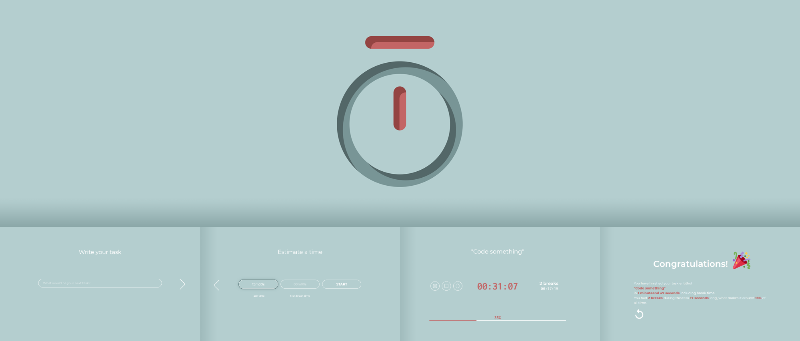

# TaskTimer App
## Main app
[master branch](https://github.com/jchojna/task-timer/tree/master)
#### created using create-react-app
work in progress

## React simple app
[react-simple branch](https://github.com/jchojna/task-timer/tree/react-simple)
#### created using create-react-app
* one task at a time only
* media queries applied
* JS code refactored
* keyboard support partly implemented

## Vanilla to React app
[react-no-jsx branch](https://github.com/jchojna/task-timer/tree/react-no-jsx)
#### created using React.createElement with no use of JSX
* functions not implemented yet

## Vanilla JS app
[vanilla branch](https://github.com/jchojna/task-timer/tree/vanilla)
#### created using document.createElement in pure JS
* JS code refactored

## Static Page
[static-page branch](https://github.com/jchojna/task-timer/tree/static-page)
#### created in html + scss + JS
* media queries not applied yet (not adjusted to mobile devices)

## Figma Project
[figma branch](https://github.com/jchojna/task-timer/tree/figma)
#### project created using figma
* to be updated