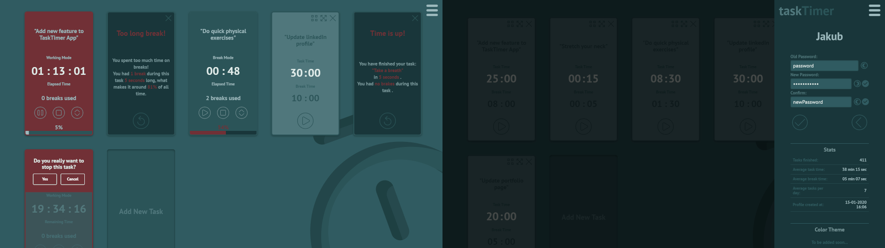

# TaskTimer App
[master branch](https://github.com/jchojna/task-timer/tree/master)

## Project info
You could say this is just another Pomodoro Clock react app, but this one is a little bit more complex and playful. I tried to make it look more like a board game with cards, interactive and entertaining. The app can handle multiple tasks going on at the same time, even though it may not be too practical to work on many tasks simultaneously, but it’s nice to see so many countdowns in action anyway:)

## Features

* adding / removing users with unique logins and secured by password
* 'remember me' functionality when user logs in / signs in
* user editing section allowing to change user's login, password, log out or remove user's profile
* data stored in local storage as Json format
* intro animation with some element's movement based on trigonometric functions
* adding / removing / editing of tasks
* inputs frontend validation
* working and break task's phases showing elapsed / remaining time
* responsiveness
* cards drag and drop functionality
* progress bars
* task summarization on task or break finish
* stats section for all finished tasks

# Other branches
For GIT training purposes, the app has started being developed in multiple phases as:

* static page (static-page branch)
* vanilla JS app using document.createElement (vanilla branch)
* vanilla JS to react.js rewriting phase with use of React.createElement, but no JSX yet (react-no-jsx branch)
* previous and simpler version of the app created using create-react-app seed is located on react-simple branch
* app’s version on master branch is still being developed as the main app

## React simple app
[react-simple branch](https://github.com/jchojna/task-timer/tree/react-simple)
#### created using create-react-app
* one task at a time only
* media queries applied
* JS code refactored
* keyboard support partly implemented

## Vanilla to React app
[react-no-jsx branch](https://github.com/jchojna/task-timer/tree/react-no-jsx)
#### created using React.createElement with no use of JSX
* functions not implemented yet

## Vanilla JS app
[vanilla branch](https://github.com/jchojna/task-timer/tree/vanilla)
#### created using document.createElement in pure JS
* JS code refactored

## Static Page
[static-page branch](https://github.com/jchojna/task-timer/tree/static-page)
#### created in html + scss + JS
* media queries not applied yet (not adjusted to mobile devices)

## Figma Project
[figma branch](https://github.com/jchojna/task-timer/tree/figma)
#### project created using figma
* to be updated